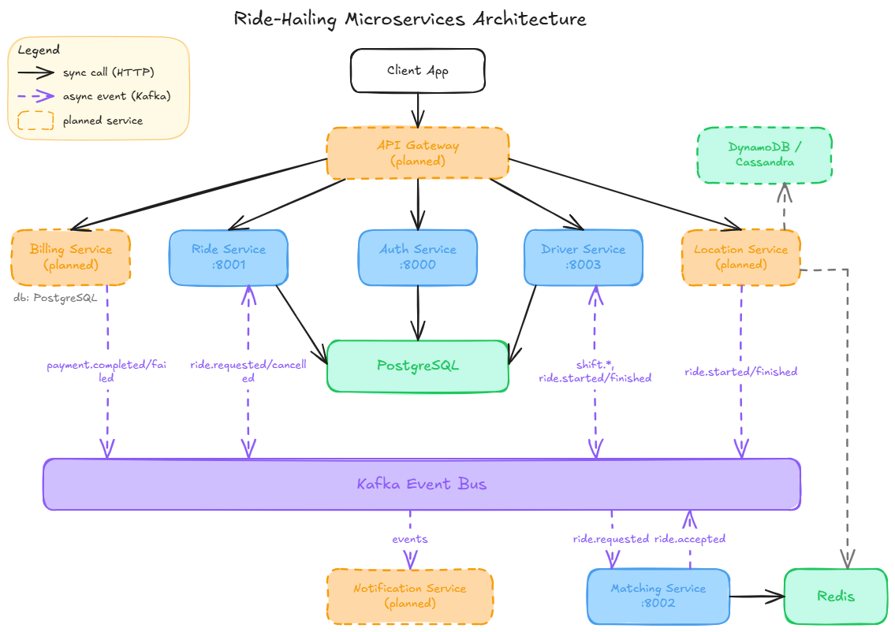
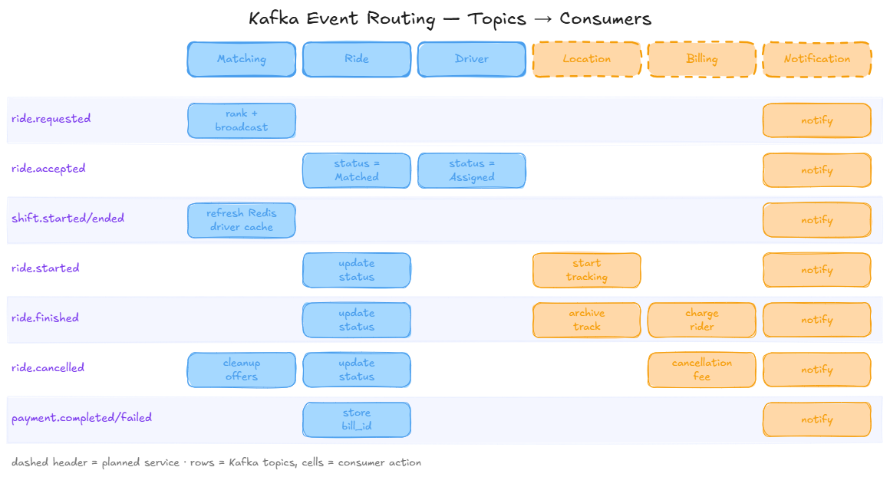
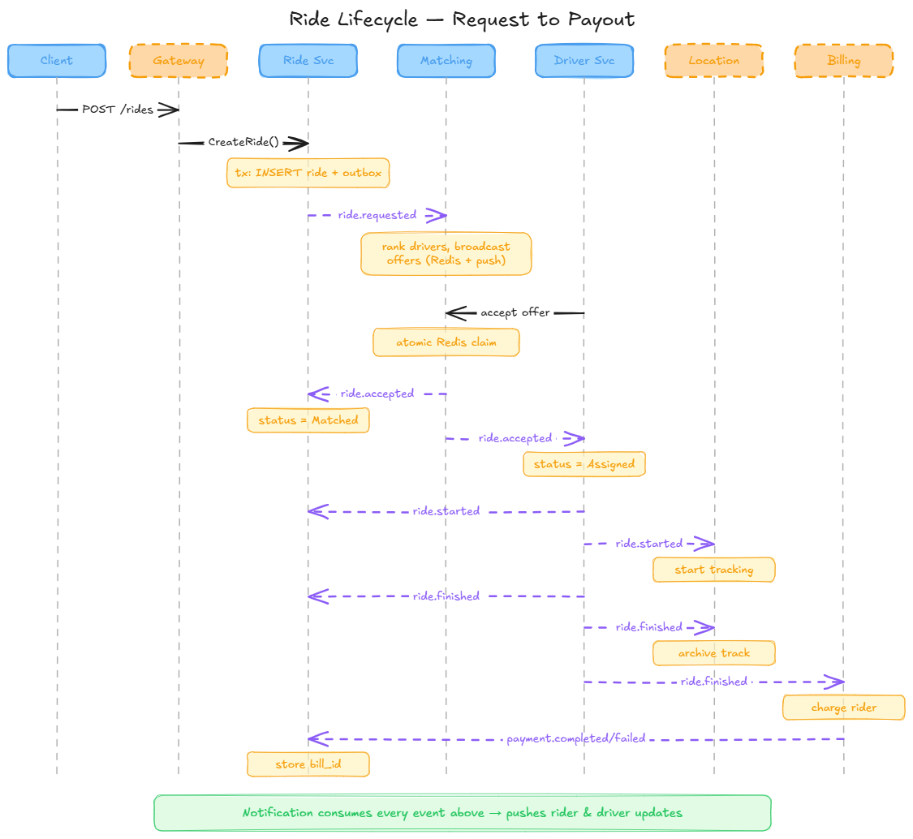

# MyUberGo — Uber Microservices Clone in Go

A distributed, event-driven clone of Uber built in Go to learn microservices patterns, event streaming, and clean software architecture.

---

## 🏗️ Architecture Overview

The system is designed as 8 services communicating asynchronously via **Apache Kafka** (event streaming) and synchronously via **REST/HTTP**. **4 are implemented today** (Auth, Ride, Matching, Driver); **4 are planned** (Location, Billing, Notification, API Gateway) — see status markers in the section below.

### System Architecture Diagram (target design)



---

## 📁 Repository Structure & Services

Each service below lists its **target** responsibilities, schema, and contracts. Where a service is already implemented, its *current* code is a simpler subset of what's described — check `services/shared/migrations/init.sql` and `services/contracts` for what actually exists today; this README describes where each service is headed.

### 1. Auth Service — ✅ Implemented (Port `:8000`)

Manages user registration/login, JWT issuance (access + refresh), token refresh, and profile lookup.

**Schema**: `USER` (id, email, password_hash, name, phone, role, timestamps, soft-delete via `deleted_at`), `REFRESH_TOKEN` (id, user_id, token, expires_at, revoked_at).

**HTTP (target)**: `POST /api/auth/register`, `POST /api/auth/login`, `POST /api/auth/refresh`, `GET /api/auth/me`, `POST /api/auth/logout`.

**Kafka**: none published or consumed.

> Current code implements `POST /signup`, `POST /login`, `POST /refresh` (no `/api` prefix, different route names than the target above) against `auth.user`/`auth.refresh_token`, without soft delete, `/me`, or `/logout` yet.

### 2. Ride Service — ✅ Implemented (Port `:8001`)

Creates ride requests, estimates fare/distance from tariffs, manages the ride state machine, and reliably publishes ride events via the transactional outbox pattern.

**Schema**: `RIDE` (client/driver ids, status machine `Requested → Matched → InProgress → Completed`/`Cancelled`, timestamps per transition, `bill_id`, `rating_id`), `RIDE_REQUEST` (pickup/destination geometry, distance, price, tariff), `TARIFF` (time-of-day pricing: Morning/Noon/Evening/Weekend), `OUTBOX_EVENTS`.

**HTTP (target)**: `POST /api/rides`, `GET /api/rides/{rideId}`, `DELETE /api/rides/{rideId}` (cancel).

**Kafka publishes**: `ride.requested`, `ride.cancelled`.
**Kafka subscribes**: `ride.accepted` (→ set driver/matched_at/status), `ride.started`, `ride.finished`, `payment.completed` (→ set bill_id).

> Current code implements `POST /request-ride`, `GET /ride`, `GET /ride/{id}`, `DELETE /ride/{id}` (cancel; no `/api` prefix, different route names than the target above) with a flat `ride.ride` table and a single fixed tariff — `ride.tariff` exists in the schema but isn't read. Publishes both `ride.requested` and, as of the cancel endpoint, `ride.cancelled`; consumes `ride.accepted` (→ `Matched`) but not yet `ride.started`/`ride.finished`/`payment.completed`. Cancellation fee is a stub that always returns `$0` — real fee logic needs the not-yet-built Billing service.

### 3. Matching Service — ✅ Implemented, simplified algorithm (Port `:8002`)

Consumes ride/shift events and matches ride requests to available drivers. Target design is a full radius-search + weighted-ranking + tiered-broadcast + atomic-accept + expanding-retry algorithm (see [Matching Algorithm](#-matching-algorithm-target-design) below); current code implements a simplified, rating-only version of that same shape, backed entirely by Redis (no Postgres — matching-service has never had a Postgres dependency in the live code path, and it was formally removed from `go.mod`/`docker-compose.yml`).

**Redis schema (current)**: `ride:{id}` (hash: pickup/destination/price/status), `drivers:online` (ZSET driverId→rating — the matchable pool), `driver:{id}` (hash: shiftID/status/rating), `ride:{id}:offered_drivers` (SET, TTL 1h), `ride:{id}:accepted_by` (STRING, `SET NX` claim, TTL 1h), `ride:{id}:cancelled` (set by the `ride.cancelled` consumer on cancellation), `driver:{id}:current_offer` (STRING rideId, TTL 30s), `driver:{id}:notifications:minute` (rate limit, sliding 60s window), `pending_ride:{id}` (retry state: attempt + deadline).

**HTTP**: `POST /rides/{rideId}/accept` (driver claims a ride; atomic `SET NX` — 409 if already taken, 400 if expired/cancelled/not offered to this driver, 404 if the ride doesn't exist), `GET /drivers/{driverId}/offer` (poll-based — no Notification service exists yet to push offers, so drivers poll for their current offer; 404 when there is none).

**Kafka subscribes (current)**: `ride.requested`, `shift.updated`, `ride.cancelled` (clears offer/pending state, sets `ride:{id}:cancelled`, and restores the driver to `drivers:online` if the ride had already been matched — using matching-service's own Redis `AcceptedBy` as the source of truth rather than the driver id carried on the event, since that reflects ride-service's Postgres row and can lag).
**Kafka publishes**: `ride.accepted` (published directly from the accept handler, no outbox — Redis has no transaction to hide a dual write behind, so a crash between the Redis match and the Kafka publish loses the event; an accepted at-most-once tradeoff since the match itself is durable in Redis).

> Simplifications vs. the target design below: **discovery is rating-only**, not geo — there's no Location service yet, so `driver.rating` (carried on an enriched `shift.updated` event) drives a `drivers:online` ZSET instead of a radius query; a driver enters the pool on `status: "Online"` and leaves it on any other status (including `"Ended"` — this used to be silently dropped by a driver-service bug that's now fixed, see below). **Broadcasting is BROADCAST-only** (top 5 at once, first accept wins) — TIERED escalation and concurrent goroutine/channel fan-out are deferred to a later Stage-3 pass. **Retry widens the candidate pool** (`attempt × 5` drivers queried) instead of expanding a geo radius, capped at 5 attempts via a `MatchRetryWorker` background sweep (ticker+select loop over `pending_ride:*`); giving up marks the ride `failed` and logs — there's no Notification service to tell the client. **Rate limiting** is a sliding 60s window (each offer resets the TTL), not a strict fixed window, but caps at 3/minute as designed. `ride.cancelled` is now produced by ride-service and consumed here (see above) — the `ride:{id}:cancelled` key is actually set, not just checked. `ride-service` now consumes `ride.accepted` too (see the Ride Service section above), so a matched ride's Postgres status does flip to `Matched`.

### 4. Driver Service — ✅ Implemented (Port `:8003`)

Manages driver profiles, shifts (start/end, earnings), and ride start/finish actions. This is the service furthest along the Clean Architecture / CQRS refactor (see `CLAUDE.md`).

**Schema**: `DRIVER` (license number/expiry, vehicle type/plate/color, rating, acceptance_rate, status: offline/online/assigned/on_ride, current_shift_id), `SHIFT` (started/ended, total_rides, total_earnings), `DRIVER_RATING`.

**HTTP (target)**: `POST /api/shifts/start`, `POST /api/shifts/end`, `POST /api/rides/{rideId}/start`, `POST /api/rides/{rideId}/finish`, `GET /api/drivers/available?lat&lon&radiusKm` (internal, used by Matching).

**Kafka publishes**: `shift.started`, `shift.ended`, `ride.started`, `ride.finished`.
**Kafka subscribes**: `ride.accepted` (→ status=Assigned).

> Current code implements `POST /driver-profile`, `PUT /driver-profile/{id}`, `GET /driver-profile`, `GET /driver-profile/{id}`, `POST /driver-shift/create`, `PUT /driver-shift/{id}`, `GET /driver-shift`, `GET /driver-shift/{id}` (no `/api` prefix, different route names than the target above) — driver-profile CRUD and shift create/update, with a working transactional-outbox worker publishing `shift.updated` events to Kafka (now carrying the driver's `rating`, consumed by matching-service's rating-only ranking — see below). It doesn't yet have license/vehicle detail fields, `acceptance_rate`/`current_shift_id`, the ride start/finish endpoints, or the `available` nearby-driver endpoint. It now consumes both `ride.accepted` and `ride.cancelled`, but both handlers are logging-only placeholders — there's no persisted "driver is on a ride" state yet (`driver_profile.status` only allows `Offline`/`Online`), so there's nothing for either handler to actually flip. A bug where setting a shift to `Ended` never published a `shift.updated` event at all (the handler returned before reaching the outbox insert) is fixed — matching-service's online-driver pool now correctly shrinks when a driver goes offline.

### 5. Location Service — 🚧 Planned (target port `:8004`)

Receives real-time GPS pings over WebSocket, keeps live location in Redis, archives history to a NoSQL store, and serves geospatial/distance queries.

**Schema**: Redis `driver:{id}:location` (TTL 5m), `ride:{id}:locations`; NoSQL `RideLocationHistory` (PK driver_id, SK timestamp_ms, GSI by ride_id, 30-day TTL); Postgres `RIDE_SUMMARY_LOCATION` (start/end location, route polyline, total distance).

**HTTP**: `POST /api/location`, `GET /api/location/distance`, `GET /api/location/drivers/nearby` (internal).

**WebSocket**: client → server `LocationUpdate` every 3-5s; server → both parties `DriverLocationUpdate`/`ClientLocationUpdate`.

**Kafka subscribes**: `ride.started` (begin tracking), `ride.finished` (archive + build polyline + clean up Redis).

### 6. Billing Service — 🚧 Planned (target port `:8005`)

Stores payment methods, creates orders on ride completion, executes payments, generates receipts, and computes driver commissions.

**Schema**: `PAYMENT_METHOD`, `ORDER` (status: pending/completed/failed/refunded, Stripe payment_intent_id), `ORDER_ITEM`, `RECEIPT`, `COMMISSION` (gross/platform fee/net, paid status).

**HTTP**: `POST /api/billing/payment-methods`, `GET /api/billing/receipts/{rideId}`.

**Kafka subscribes**: `ride.finished` (→ create order, charge, receipt, commission), `ride.cancelled` (→ cancellation fee if within 5 min of match).
**Kafka publishes**: `payment.completed`, `payment.failed`.

### 7. Notification Service — 🚧 Planned (target port `:8006`)

Fans out push/SMS/email notifications for every ride/shift/payment lifecycle event.

**Schema**: `NOTIFICATION` (user_id, type: push/sms/email, template, payload, status: queued/sent/delivered/failed).

**Kafka subscribes to everything**: `ride.requested`, `ride.accepted`, `ride.started`, `ride.finished`, `ride.cancelled`, `payment.completed`, `shift.started`, `shift.ended` — each mapped to a specific notification to client and/or driver (see table in-code once implemented).

### 8. API Gateway — 🚧 Scaffolded, not implemented (target port `:80`/`:443`)

Single entry point: validates the JWT issued by Auth Service, extracts claims (`sub`, `email`, `role`, `driver_id`), strips `Authorization` and injects `X-User-Id`/`X-User-Email`/`X-User-Role`/`X-Driver-Id` headers, routes by path prefix, and rate-limits (per-user, per-IP, per-endpoint).

**Routes (target)**: `/api/auth/*` → Auth (no token), `/api/rides/*` → Ride, `/api/shifts/*` + `/api/drivers/*` → Driver, `/api/location/*` → Location, `/api/billing/*` → Billing, `/api/notifications/*` → Notification (internal only).

> Downstream services already expect gateway-forwarded headers (e.g. `ride-service` reads `X-User-Id` directly) even though the gateway itself doesn't exist yet — see Phase 2 of the roadmap.

---

## 🎯 Matching Algorithm (target design)

The full design for `matching-service`'s ride-to-driver matching. Current code implements a simplified version of this shape (rating-only ranking, BROADCAST-only, pool-widening retry instead of radius expansion) — see the "Matching Service" section above for exactly what's simplified and why.

1. **Discovery** — on `ride.requested`, query online, available drivers within a radius (default 5km bounding box).
2. **Ranking** — score each candidate: `0.4×distance_score + 0.4×rating_score + 0.2×acceptance_score` (all normalized 0-1), sort by score desc then distance asc.
3. **Broadcasting** — configurable strategy: `BROADCAST` (top 5 at once, first accept wins), `SEQUENTIAL` (one at a time with a timeout per driver), or `TIERED` *(recommended)*: top 2 high-rated drivers (10s) → next 5 (15s) → next 10 (20s), escalating only on timeout.
4. **Atomic acceptance** — a driver's accept does `SET ride:{id}:accepted_by = driver_id NX`; only the first successful `SET` wins, everyone else gets 409. Cancelled/expired offers are rejected before the atomic claim.
5. **Retry with expanding radius** — if nobody accepts within the window, retry from Discovery with radius +2km (5→7→9→11→13, capped at 15km) up to 5 attempts, then give up and notify the client.
6. **Rate limiting** — cap offers per driver at e.g. 3/minute (`driver:{id}:notifications:minute`, TTL 60s) so a busy driver isn't spammed; skip to the next-ranked driver instead.

---

## 🔁 End-to-End Event Flow (target design)




## 🚕 Full ride  lifecycle, client request to payout:



---

### Infrastructure Stack

The infrastructure runs locally via Docker Compose:
*   **PostgreSQL 15**: Primary relational storage shared across services (using separate schemas/databases).
*   **Redis 7 (Alpine)**: Cache and fast-access session/state store; target store for Matching's offer/accept state and Location's live GPS cache.
*   **Apache Kafka**: Distributed event streaming platform.
*   **Kafka UI**: Web dashboard for inspecting Kafka topics, consumer groups, and messages (accessible on Port `:8080`).
*   **DynamoDB/Cassandra** *(planned)*: time-series store for Location Service's GPS history (not yet in `docker-compose.yml`).

---

## 🗺️ Architectural Transition: Single File to Clean DDD

To facilitate learning, the services are designed in progressive architectural complexity:

1.  **Phase 1 (Procedural Scripting)**: Implement the core service in a single `main.go` file. Focus on speed, database integrations, HTTP handler mapping, and event consumer setups.
2.  **Phase 2 (Layered / Clean Architecture)**: Move logic out of HTTP handlers and raw SQL queries into distinct architectural boundaries:
    *   **Domain Layer**: Pure business logic (entities, value objects, domain rules). Independent of databases or framework libraries.
    *   **Application Layer**: Use cases, command and query handlers (CQRS), ports (interfaces for repositories, message publishers).
    *   **Infrastructure/Persistence Layer**: Adapters implementing the ports (PostgreSQL repositories, Kafka publishers, Redis caching).
    *   **Interfaces/HTTP Layer**: Routers, controllers, request parsing, and response rendering.

`driver-service`, `matching-service`, and `ride-service` are all fully in Phase 2 now; `auth-service` is still Phase 1.

---

## 🚀 Development & Refactoring Roadmap

> For the ordered, checkable step-by-step task list (what's being worked on right now), see **[PLAN.md](./PLAN.md)**. The phases below are the high-level roadmap; PLAN.md breaks the current phase into small steps.

### Phase 1: Clean Architecture Refactoring (Core Services)
*   [x] `driver-service` refactored to CA/CQRS.
*   [x] `matching-service` refactored to CA/CQRS + simplified matching algorithm implemented (discovery/broadcast/atomic accept/retry/rate limiting against Redis, rating-only ranking). Remaining: TIERED broadcast strategy, geo-radius discovery (needs Location service), Stage-3 concurrent fan-out (goroutines/channels for the broadcast step).
*   [ ] **Refactor `ride-service`**: `ride-service` is already Stage 2 (CQRS/DDD layered, not Stage 1 as this line previously implied) and the `Cancelled` cancellation flow (`DELETE /ride/{id}`, `ride.cancelled` publish/consume) is now implemented — see the Ride/Matching/Driver Service sections above. Remaining: add `RIDE_REQUEST`/`TARIFF` tables and time-of-day pricing (schema has `ride.tariff` but it isn't read), and a real (non-stub) cancellation fee calculator once Billing exists.
*   [ ] **Refactor `auth-service`**: move JWT generation and password hashing into domain services, add `updated_at`/`deleted_at` soft delete, `GET /api/auth/me`, `POST /api/auth/logout`.

### Phase 2: Gateway Configuration & Inter-service Auth
*   [ ] Scaffold and implement the **API Gateway**: JWT validation against the shared secret, `X-User-Id`/`X-User-Email`/`X-User-Role`/`X-Driver-Id` header injection, path-based routing table, rate limiting.
*   [ ] Secure downstream service communication (verify downstream endpoints only accept gateway-forwarded headers).

### Phase 3: New Feature Services
*   [ ] **Location Service**: WebSocket GPS ingestion, Redis live-location cache, NoSQL (DynamoDB/Cassandra) history with TTL + ride-id GSI, distance/nearby-drivers queries, `ride.started`/`ride.finished` consumers.
*   [ ] **Billing & Payment Service**: payment methods, `ride.finished`/`ride.cancelled` consumers, order/receipt/commission generation, `payment.completed`/`payment.failed` publishers.
*   [ ] **Notification Service**: consume every ride/shift/payment event and fan out push/SMS/email per template, with delivery-status tracking.

### Phase 4: Production Quality & Observability
*   [ ] Standardize structured logging using `zap` or `logrus` across all services.
*   [ ] Implement OpenTelemetry tracing to trace requests end-to-end from the Gateway through PostgreSQL and Kafka.
*   [ ] Set up Prometheus metric endpoints for HTTP response rates/latencies and Kafka message consumption times.

---

## 🛠️ Quick Start

1.  **Spin up infrastructure and services**:
    ```bash
    docker-compose up --build
    ```
2.  **Inspect database migrations**:
    Schemas are defined in *init.sql* and loaded automatically when the Postgres container starts.
3.  **Inspect events**:
    Navigate to the Kafka UI at `http://localhost:8080` to view active topics and consumer groups.
